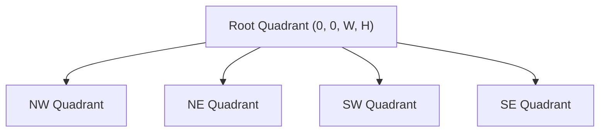

# Quadtree Spatial Partitioning Skill

High-efficiency, zero-dependency Python implementation of **2D Quadtree Spatial Partitioning** for hierarchical point indexing and clustering.

## Features
- **Hierarchical Quadrant Splitting**: Seamlessly partitions bounding planes into NW, NE, SW, and SE subtrees.
- **Logarithmic Spatial Lookup**: Enables \(O(\log N)\) point insertion and regional window queries.
- **Zero External Dependencies**: Pure Python standard library.
- **Native MCP Protocol**: JSON-RPC 2.0 stdio server compatible with Claude Desktop, Cursor, and Windsurf.

## Architecture

